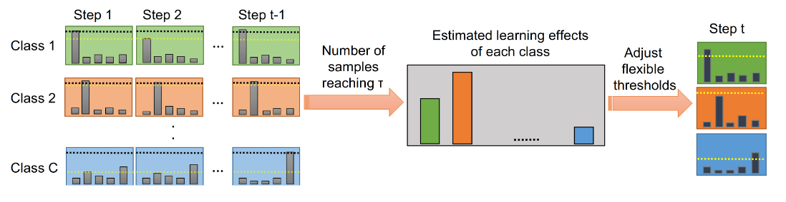
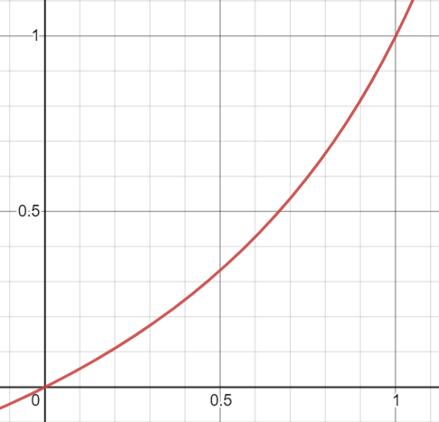
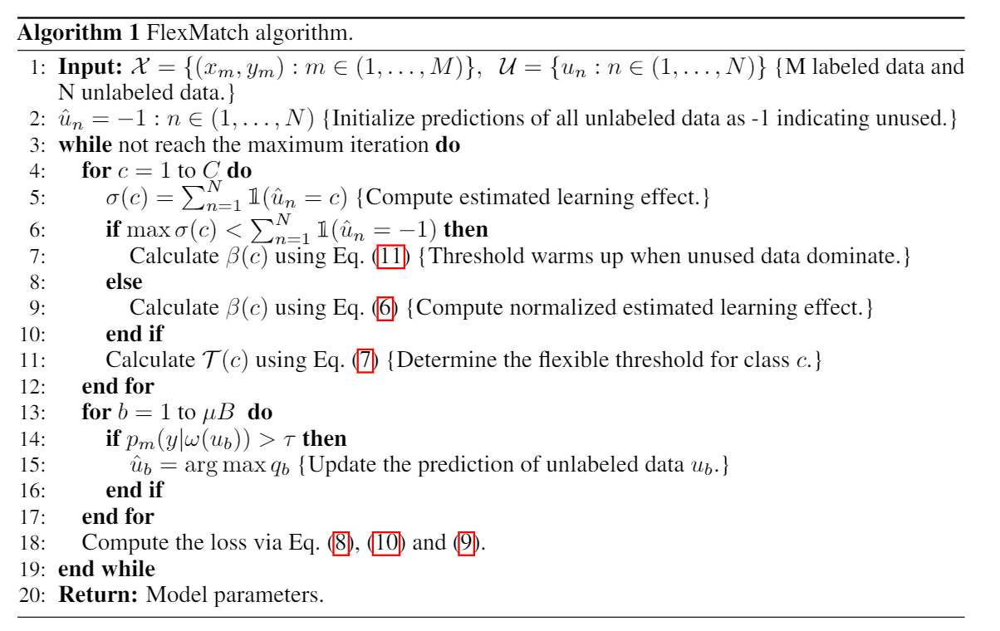
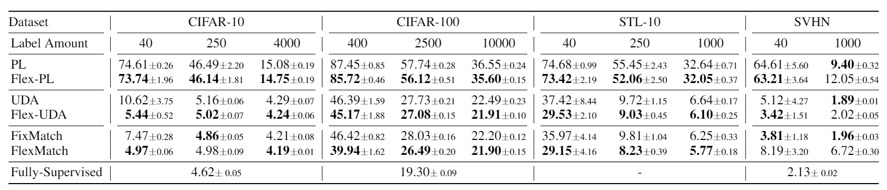
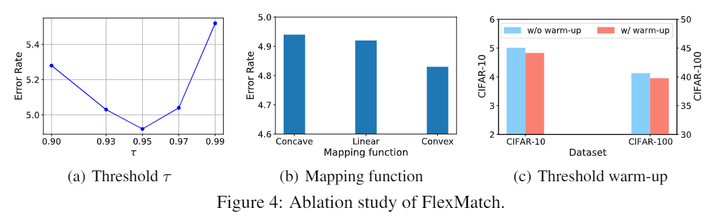
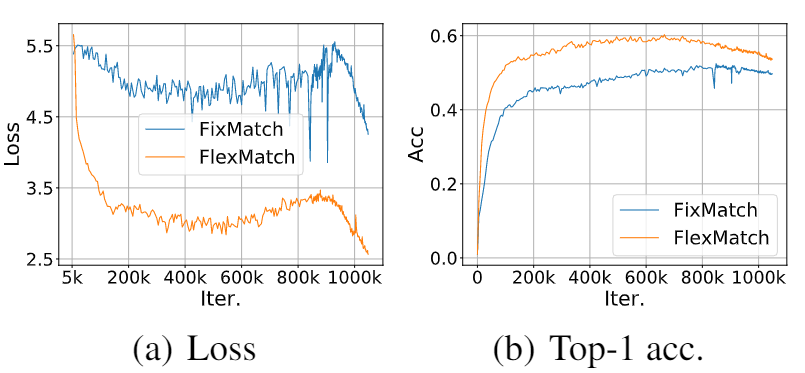

# 方案动机

文章的出发点是为了解决其他半监督方法比如 FixMatch[2] 中对固定阈值的设置问题，作者 argue 说固定阈值的设置是不合理的，不同类别在不同训练阶段的状态是不一样的，因此文中采用了课程学习（curriculum learning）的思路通过伪标签的状态来自适应的调整半监督训练过程中的阈值，提出的方法叫做 FlexMatch。

# 方法介绍

方法示意图如下所示：

半监督训练中的伪标签损失如下所示，其中 $\tau$ 为预设的固定阈值：

$\frac{1}{\mu B} \sum_{b=1}^{\mu B} \mathbb{1}\left(\max \left(p_{m}\left(y \mid \omega\left(u_{b}\right)\right)\right)>\tau\right) H\left(\hat{p}_{m}\left(y \mid \omega\left(u_{b}\right)\right), p_{m}\left(y \mid \omega\left(u_{b}\right)\right)\right)$

FlexMatch 认为某个类别更低的预测准确率表示这个类别的学习效果（learning effect）相对较差，因此需要适当的降低这个类别的阈值，比较直观的解法是通过分割的验证集来判断学习效果，但是由于标注数据本来就比较少了，因此文中提出了采用统计**该类别**预测**置信度高于阈值**的**无标签样本数量**作为学习效果的估计：

$\sigma_{t}(c)=\sum_{n=1}^{N} \mathbb{1}\left(\max \left(p_{m, t}\left(y \mid u_{n}\right)\right)>\tau\right) \cdot \mathbb{1}\left(\arg \max \left(p_{m, t}\left(y \mid u_{n}\right)=c\right)\right.$

$\beta_{t}(c)=\frac{\sigma_{t}(c)}{\max _{c} \sigma_{t}}$

$\mathcal{T}_{t}(c)=\beta_{t}(c) \cdot \tau$\

其中， $\sigma_t (c)$ 表示类别 $c$ 的学习效果，通过归一化后得到了 $\beta_t(c)$，其中预测数量最多的类别为 1，然后自适应系数会直接乘到预设的阈值上，来对不同类别调整阈值，最终 $\tau_t(c)$ 为训练计算 loss 时所用的阈值。

考虑到训练前期的时候模型预测不稳定，导致学习效果的估计是有偏的，因此引入了 warmup 过程去解决前期的训练偏差问题，其实就是见过的无标签样本少的时候就让各类别的阈值尽量变小。

$\beta_{t}(c)=\frac{\sigma_{t}(c)}{\max \left\{\max _{c} \sigma_{t}, N-\sum_{c} \sigma_{t}\right\}}$

FlexMatch 额外引入了非线性函数来让自适应阈值变得更加平滑，如下所示，采用的非线性函数是 $\mathcal{M}(x) = \frac{x}{2-x}$，函数的可视化图形如下图所示（感觉也没啥区别）。

$\mathcal{T}_{t}(c)=\mathcal{M}\left(\beta_{t}(c)\right) \cdot \tau$

整个方法的算法流程如下所示：

# 实验对比

相比于 FixMatch，FlexMatch 在其基础上对半监督的训练性能还是有一定的提升的，同时文中通过实验对比发现 FlexMatch 在收敛速度上更快（阈值降低了一般来说 loss 确实收敛更快）。

部分消融实验对比，warmup 还是有点用的，但是这个映射函数感觉就是作用不是很大，只有不到 0.1% 的提升，实验中还刻意把 y 轴做了调整。

CIFAR-100 上 400 张样本的收敛速度对比实验如下：

# 分析讨论

* 思路很 intuitive，但是我比较好奇的一点是，究竟学习效果差、预测伪标签质量差要减小阈值还是增加阈值，感觉如果是从指标上来说的减小阈值更好一些，可以提高 recall 或者检测中的 mAP，毕竟 precision 的指标作用没有那么大；
* 非线性映射函数的加入感觉没有特别大的必要，不同的映射函数实验区别不大
* 代码开源整合了其他的方法还是挺有价值的，可以帮助后续的半监督方案复现对比

# 参考文献

[1] FlexMatch: Boosting Semi-Supervised Learning with Curriculum Pseudo Labeling. NIPS 2021.
[2] FixMatch: Simplifying Semi-Supervised Learning with Consistency and Confidence. NIPS 2020.
[3] Dash: Semi-Supervised Learning with Dynamic Thresholding. ICML 2021.