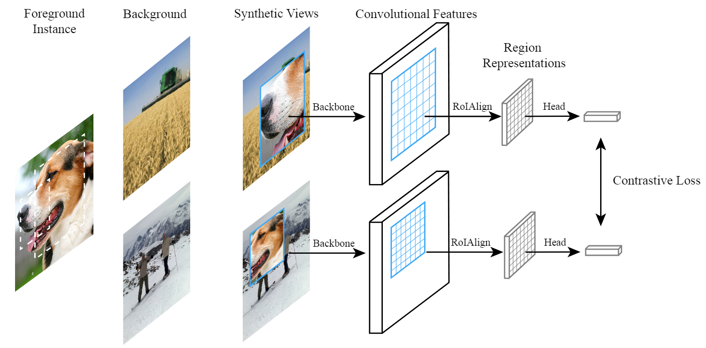
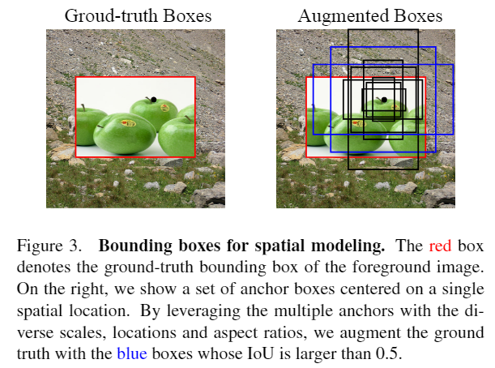
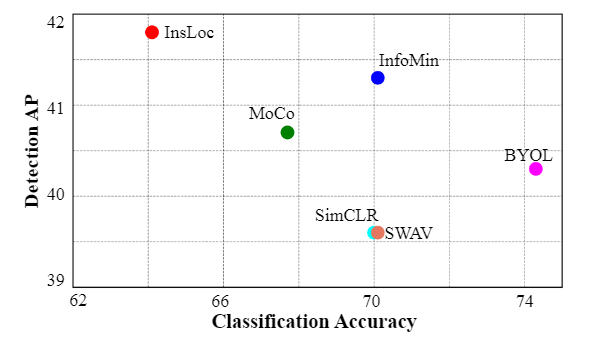
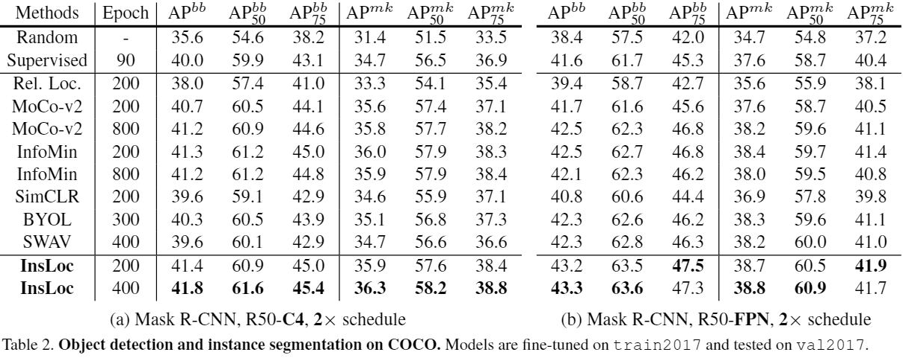
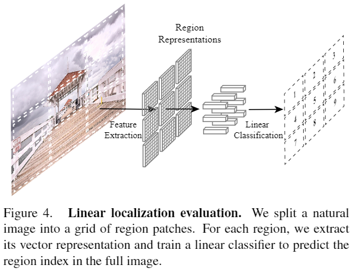
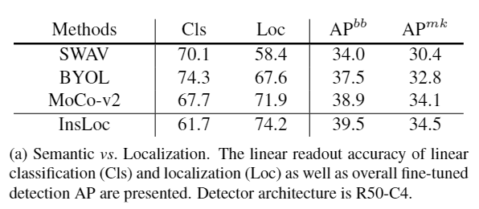

# 方案动机

自监督方法比如 MoCov2、SimCLR 或者 BYOL 等在分类任务上已经有了长足的进步，部分方法甚至在下游任务上超过了 ImageNet 全监督训练的迁移效果，但是在检测任务上的迁移性能通常与分类任务上的迁移性能不一致，与监督预训练模型的差异也较大，这也是本文的主要动机，针对检测任务来修改设计自监督方案。

# 方法介绍

本文提出了一种新的自监督 pretext 任务，其主要目的是将图像实例扩增后随机粘贴到不同的背景图像上，由检测框构成了检测任务中的前景图像和背景图像，通过对齐前景图像的特征来实现在下游检测任务上更好的迁移效果，最后的实验结果表明 InsLoc 在语义分类任务上的迁移性能较弱，但是在下游的检测定位上性能却明显提高。

文中在解释动机的时候主要提出了两个问题：

1. architecture misalignment：自监督得到的预训练网络在迁移到下游检测任务的时候通常需要加入任务特定的网络结构，比如 FPN 或者 RPN 等，这些新增的网络结构减少了自监督特征到下游任务的迁移能力（学习的通道变长了）；
2. feature misalignment：分类任务考虑的是整体图像的语义信息，要求模型对图像特征具有旋转和缩放的不变性，这样能保证预测结果在扩增前后保持一致，而检测任务要求的是定位，需要特征具有对旋转和缩放的等变性，模型才能在扩增前后定位到相同的目标

## Instance Localization Pretext Task

InsLoc 采用了和 MoCov2 一致的训练方式，但是在计算的时候提取特征的方式是不同的，对比学习损失如下所示：

$$ \begin{aligned}I_{q}^{\prime}, b_{q} &=C\left(I_{q}, B_{q}\right) \\I_{k_{+}}^{\prime}, b_{k_{+}} &=C\left(I_{k_{+}}, B_{k_{+}}\right)\end{aligned} $$

$$ \begin{aligned}v_{q}^{\prime} &=\operatorname{RoIAlign}\left(f\left(I_{q}^{\prime}\right), b_{q}\right) \\v_{k_{+}}^{\prime} &=\operatorname{RoIA} \operatorname{lign}\left(f\left(I_{k_{+}}^{\prime}\right), b_{k_{+}}\right)\end{aligned} $$

$$ \mathcal{L}=-\log \frac{\exp \left(\phi\left(v_{q}\right) \cdot \phi\left(v_{k_{+}}\right) / \tau\right)}{\sum_{i=0}^{N} \exp \left(\phi\left(v_{q}\right) \cdot \phi\left(v_{k_{i}}\right) / \tau\right)} $$

其中 $I_q, I_{k+}$ 分别是同一张图像的两次不同仿射变换后的图像， $B_q, B_{k+}$ 是两张随机选择的背景图像，通过粘贴的方式得到了前景图像检测框 $b_q, b_{k+}$，再利用 ROIAlign 获取对应的前景图像特征，对应的特征用于计算对比损失。由于池化操作的存在，提取到的特征一定程度上包含了不同的背景语义信息，因此使得模型尽可能的学习到前景图像的空间特征。

## Bounding-Box Augmentation

上面也提到了 InsLoc 解释背景语义特征模糊了提取到的前景特征，因此对检测框的扩增可以进一步加强这样的扰动，InsLoc 采用的并不是直接对坐标框加入扰动，而是采用了 RPN 中使用的 anchors 机制，通过计算标注框与 anchors 之间的 IoUs，overlap 大于 0.5 中的 anchors 会被随机选择其中一个作为扩增后的检测框，如下图所示：

## Architectural Alignment

前面提到了自监督任务的另外一个 misalignment 是来自于网络结构的，而 instance localization 的 pretext task 允许自监督任务的结构和下游的检测任务结构尽可能的保持一致，文中也给出了实验中使用的两个架构：

- R50-C4：ResNet50 第四层 residual block 的输出特征用于提取 RoI 区域；
- R50-FPN：在标准 ResNet50 上方加入了 FPN 层，全部4个 stage 的特征都会用于提取 RoI 特征并进行对比学习，每层特征也会设置一个特定的 queue 存在对应的特征；

两个 backbone 的主要区别在于有无 FPN 层，加了 FPN 层的效果会更好一些。

# 实验对比

InsLoc 和其他自监督学习算法在下游迁移任务的对比，可以看出来分类任务的性能明显劣于其他方法，但是在检测任务上有较大的提升。

COCO 数据集上检测和实例分割性能对比，这里也能看出来 R50-FPN 和 R50-C4 的性能差距。

比较有意思的是文中为了验证模型确实学习到了 localization 特征而非是整体的语义特征，设计了一种 linear localization evaluation 的对比实验，也就是让自监督训练后的模型预测图像中的 patch 的顺序来证明自己的设计动机，和 linear classification 的指标对比也反应了 InsLoc 在下游分类任务和检测任务上性能指标的差异。

linear localization evaluation 方法示意图如下所示：

不同自监督方法在下游任务 linear classification 和 linear localization 指标对比如下所示：

# 分析讨论

这篇文章还是蛮有意思的，角度比较新颖，总结提出的两个 misalignment 也比较有借鉴意义，自监督检测或者分割的方法需要更多的考虑任务特点而不能一味的套用分类任务的架构，很多其他的自监督检测方法在训练中也是类似的思路，并且也加入了部分检测网络结构一起训练。

看了源码实现，感觉实际上要比文中阐述的亮点要复杂很多，可能影响最终的因素是在于那些实现细节上（而且不知道为什么就是没有开源 R50-C4 的模型结构，很好奇第五层 residual block 是指的什么）。

# 参考文献

[1] Momentum Contrast for Unsupervised Visual Representation Learning. CVPR 2020.
[2] Improved Baselines with Momentum Contrastive Learning. ArXiv.
[3] A Simple Framework for Contrastive Learning of Visual Representations. ICML 2020.
