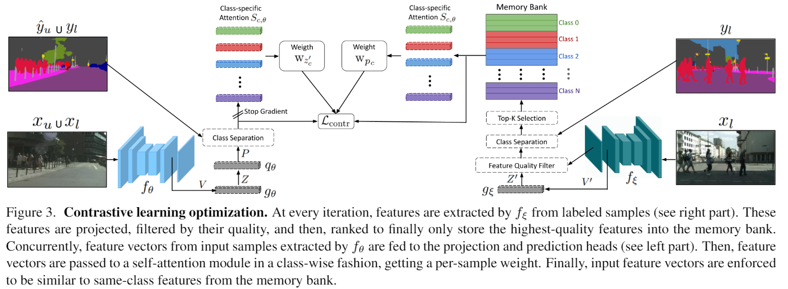
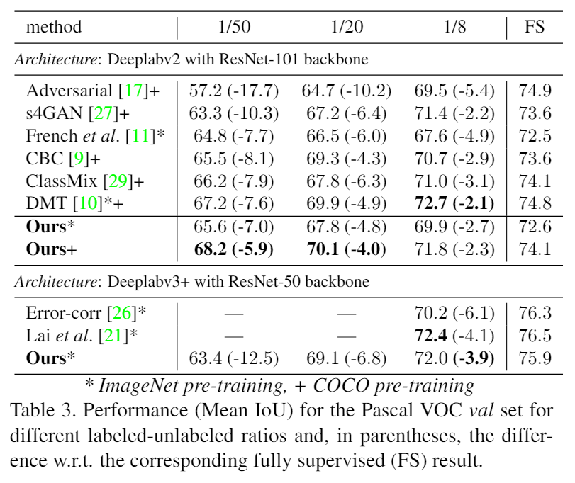
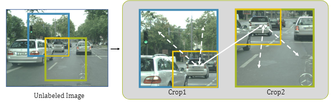
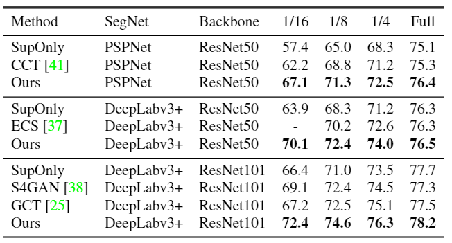
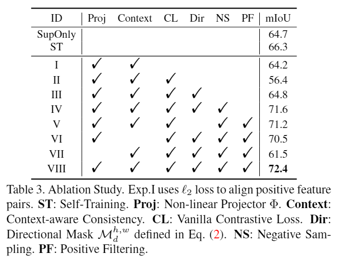

# 半监督语义分割 + 对比学习

这两天主要在看了下对比学习的相关工作，正好之前看到了两篇半监督语义分割+对比学习的论文，做一下简单的总结。两篇工作为：

* Semi-Supervised Semantic Segmentation with Pixel-Level Contrastive Learning from a Class-wise Memory Bank. ArXiv 2021.
* Semi-supervised Semantic Segmentation with Directional Context-aware Consistency. CVPR 2021.

## 对比学习

对比学习（contrastive learning）算是最近几年比较火热的研究方向之一了，典型的方法有 SimCLR[3] 系列、MoCo[4] 系列以及 BYOL[5] 等，各种方法之间相互借鉴又互有创新，并且在下游的 imagenet 分类任务上已经可以超过全监督的性能，并且在探索在其他视觉任务比如检测和分割上的效果，属实是推动了大家对计算机视觉领域的热情。

众所周知，全监督任务的典型问题在于对大量数据标注的需求，而数据标注所需要的人力物力以及时间等开销是非常庞大的，有多少智能就有多少人工，所以研究者们将视线放到了如何利用大量的无标签样本上。半监督是综合利用标注样本和无标注样本进行训练提升模型性能的一种方法，而自监督则是完全不需要标注样本，使用大量的无标注样本根据定义的 pretext task 来进行无监督训练，再利用从图像中学到的潜在表征知识，在下游任务中去 finetune，来达到知识迁移的目的。

详细的就不多介绍了，这里的重点也不是自监督任务。

## 半监督语义分割

去年调研的时候半监督语义分割的工作还不是很多，大部分方法还是和分类任务差不多，基本就是利用一些常用的半监督组件 mean teacher、强弱扩增或者 co-training 之类的方法，有一部分工作[6]探索了分割任务和分类任务的不同，从扩增方式上做了些改进还是挺有意思的。这次主要介绍的是最近看到的利用自监督任务中常用的对比学习方法去提升半监督分割性能的工作，把自监督的架构融合到了半监督框架中，和之前的一篇 supervised contrastive learning[7] 放在一起看的话倒是有种可以将全监督、半监督和自监督统一到同一个框架中的可能。

### CMB (Class-wise Memory Bank)

#### 方法介绍

CMB 方案的目的是利用对比学习的思想来让分割网络在**不同数据集**（标注数据集和无标注数据集）中学习到的**相同类别**的特征相似，文中采用的是 BYOL 的自监督学习结构，只使用正样本对来学习特征，另外也借鉴了 MoCo 的思路构建了 memory bank，将教师模型（学生模型的EMA，对应 MoCo 中的 momentum encoder）在**标注数据**上的特征进行筛选并存储，用于提供高质量的特征给对比学习损失，方案示意图如下所示。

整个半监督学习损失包括监督损失 $\mathcal{L}_{sup}$、伪标签损失 $\mathcal{L}_{pseudo}$、熵最小化损失 $\mathcal{L}_{ent}$ 以及对比学习损失 $\mathcal{L}_{contr}$，伪标签损失中没有采用分类和监测中常用的按照阈值进行筛选，而是直接用置信度预测最大的类别作为伪标签类别，配合熵最小化损失（期望模型的预测结果更加确信）其实也是相当于隐式的加入了阈值筛选机制。另外计算伪标签损失中也加入了强弱扩增。

损失计算公式如下所示：

$$\mathcal{L}=\lambda_{\text {sup }} \mathcal{L}_{\text {sup }}+\lambda_{\text {pseudo }} \mathcal{L}_{\text {pseudo }}+\lambda_{\text {ent }} \mathcal{L}_{\text {ent }}+\lambda_{\text {contr }} \mathcal{L}_{\text {contr }}$$

熵最小化损失如下：

$$\mathcal{L}_{e n t}=-\frac{1}{A} \frac{1}{N} \sum_{a=1}^{A} \sum_{n=1}^{N} \sum_{c=1}^{C} f_{\theta}\left(x_{u}^{a, n, c}\right) \log f_{\theta}\left(x_{u}^{a, n, c}\right)$$

最重要的是对比学习损失部分，采用了 BYOL 的自监督学习范式，学生网络包括 projection head 和 prediction head（网络结构和 BYOL 保持一直），学生网络的 prediction head 特征会和 memory bank 中的特征（memory bank 中的特征由教室网络的 projection head 提取）进行回归损失计算，但是由于并不是同一个类别的全部特征都适合进行计算，因此文中额外引入了一个 attention module 来计算对比学习损失的权重。

学生和 memory bank 中的特征都会独立通过 attention 计算出权重 $w_p$ 和 $w_z$（L1 norm），再把两个损失乘到对比学习损失上进行加权，用于选择学生和教师的哪些特征适合用于计算对比损失。

学生特征和教师特征（L2 norm）的相似度计算如下所示：

$$\mathcal{C}\left(p_{c}, z_{c}^{\prime}\right)=\frac{\left\langle p_{c}, z_{c}^{\prime}\right\rangle}{\left\|p_{c}\right\|_{2} \cdot\left\|z_{c}^{\prime}\right\|_{2}}$$

对比学习损失如下所示（在原来的损失基础上分别乘上了教师和学生特征的 attention 分数）：

$$\mathcal{D}\left(p_{c}, z_{c}^{\prime}\right)=\mathrm{w}_{p_{c}} \mathrm{w}_{z_{c}^{\prime}}\left(1-\mathcal{C}\left(p_{c}, z_{c}^{\prime}\right)\right)$$

最终的对比学习损失为：

$$\mathcal{L}_{\text {contr }}=\frac{1}{C} \frac{1}{N_{p_{c}}} \frac{1}{N_{z_{c}^{\prime}}} \sum_{c=1}^{C} \sum_{p_{c} \in P_{c}} \sum_{z_{c}^{\prime} \in Z_{c}^{\prime}} \mathcal{D}\left(p_{c}, z_{c}^{\prime}\right)$$

用 attention 模块解决了不同特征之间学习权重的问题后，另外一个需要解决的问题则是怎么筛选教师模型在**标注数据**上的特征并存储在 memory bank 中。文中引入了两个规则来进行挑选：

* 按照置信度筛选出高质量的样本特征，也就是说最大类别的分类置信度需要大于一定阈值（文中采用的 0.95）
* 按照 attention 权重排序筛选出其中的 topk 权重

这两条规则过滤出来的特征最终会按照先入先出的顺序存放在 memory bank 中。

#### 实验对比

这里重点提一下网络结构：

* Projection head 的网络结构：Linear - BN - ReLU - Linear
* Prediction head 的网络结构：Linear - BN - ReLU - Linear
* Attention 模块的网络结构：Linear - BN - LeakyReLU - Linear - Sigmoid，总共有 $2\times N_{classes}$ 的模块，特点是 class-wise的（也就是每个类别预测不同的 attention 分数），另外教师的 projection head 以及学生的 prediction head 用不同的模块。

实验上好像没有对比到最新的一些方法，现在性能应该也不是 SOTA 的了，实验分析部分都比较常规。

消融实验对比如下所示：

### DCC (Directional Context-aware Consistency)

#### 方法介绍

DCC 这篇文章的主要动机在于半监督语义分割训练中模型会过拟合训练数据，导致过分依赖于上下文语义信息（环境信息）进行决策，而忽略了物体本身的语义特点。

针对上面的问题 DDC 在文中采用了一种新的扩增方法，能让模型对背景信息的变化更加鲁棒（context-aware consistency），同时为了保证扩增前后语义特征的对齐，文中提出了 Directional Contrastive Loss 进行对比学习，并采用了 positive pair 和 negative pair 的采样来保证对比学习的性能。方案示意图如下所示：

文章的思路是和自监督的工作 DenseCL[8] 以及 PixPro[9] 很相似的，利用语义分割的像素级任务特点去尝试采用跟契合的扩增方式，这也是之前的半监督分割工作一直去研究的部分，至于说是不是真的会过拟合上下文语义信息，我是持怀疑态度的。

**Context-Aware Consistency**. 扩增上比较简单，就是要求两次随机 crop 前后重叠区域在模型特征上具有不变性（随机扩增打乱了背景的语义信息）：

**Directional Contrastive Loss**. Directional Contrastive Loss 在对比学习损失的计算基础上加入了一个学习的方向，主要目的是利用对比学习去拉近 positive pair（同一个像素点不同扩增下的特征）的距离以及拉开 negative pair（不同像素点之间的距离），同时利用伪标签置信度加入了方向信息，防止模型学到的特征向低置信度方向 collapse，避免学到 trivial solution，公式如下所示：

$$\begin{aligned}
&l_{d c}^{b, n s, p f}\left(\phi_{o 1}, \phi_{o 2}\right)= \\
&-\frac{1}{N} \sum_{h, w} \mathcal{M}_{d, p f}^{h, w} \cdot \log \frac{r\left(\phi_{o 1}^{h, w}, \phi_{o 2}^{h, w}\right)}{r\left(\phi_{o 1}^{h, w}, \phi_{o 2}^{h, w}\right)+\sum_{\phi_{n} \in \mathcal{F}_{u}} \mathcal{M}_{n, 1}^{h, w} \cdot r\left(\phi_{o 1}^{h, w}, \phi_{n}\right)}
\end{aligned}$$

看上去很复杂， $r(\phi_1, \phi_2) = exp(s(\phi_1, \phi_2) / \tau)$ 计算两个特征之间的相似度，分数的部分为对比学习损失的计算公式，$N$ 表示扩增前后重叠的区域（ $h,w$ 为长宽），$\mathcal{F}_u$ 为负样本对， $\phi_n$ 为负样本。只看整体的话就是一个对比学习公式，重要的部分在于论文中采用两个 mask 权重，给对比学习损失的计算加入了方向。

其中，$M_d^{h, w}$ 表示的是损失方向，仅朝高置信度方向计算损失，也就是两次扩增中置信度较低的特征会朝置信度较高的特征去学习，而不会有相反的学习方向：

$$\mathcal{M}_{d}^{h, w}=1\left\{\max \mathcal{C}\left(f_{o 1}^{h, w}\right)<\max \mathcal{C}\left(f_{o 2}^{h, w}\right)\right\}$$

在损失方向的基础上文中加入了对正样本的筛选，只对置信度大于一定阈值 $\gamma$ 的样本计算损失，避免置信度低的特征干扰训练，构成了正样本筛选策略：

$$\mathcal{M}_{d, p f}^{h, w}=\mathcal{M}_{d}^{h, w} \cdot 1\left\{\max \mathcal{C}\left(f_{o 2}^{h, w}\right)>\gamma\right\}$$

$M_{n,1}^{h,w}$ 为负样本筛选策略，与对比学习采用 distance discrimination 作为 pretext text 不同，半监督训练中不同伪标签是存在类别信息的，即便是不同的像素点也可能是属于同一个类别的，不适合作为对比学习损失计算，因此挑选伪标签预测类别不同的样本作为负样本对：

$$\mathcal{M}_{n, 1}^{h, w}=1\left\{\tilde{y}_{o 1}^{h, w} \neq \tilde{y}_{n}\right\}$$

#### 实验对比

实验分析上也是常规的分析，没有特别有意思的部分，不过实验性能应该是现在的 SOTA 了。

消融实验对比如下所示：

## 总结对比

这两篇工作的思路有所重叠，都是在半监督语义分割任务中加入了对比学习损失，但是在实现角度还是有比较大的不同，DCC 工作还是基于 multi-view 样本下特征的对比，引入了 crop 的扩增对上下文信息进行变换（SimCLR / MoCo 结构），CMB 则是希望同类别像素样本在特征上保持相似，并且只计算了 positive pair 的相似度（BYOL 结构）。

对比学习在其他方向上应该还是能有很多应用，但是其最大的缺点在于方案很大程度上是结果导向的，很难能从实验分析中获得对改进方向有启发意义的信息，这点上是和度量学习相同的。

## 相关文献

[1] Semi-Supervised Semantic Segmentation with Pixel-Level Contrastive Learning from a Class-wise Memory Bank. ArXiv 2021.

[2] Semi-supervised Semantic Segmentation with Directional Context-aware Consistency. CVPR 2021.

[3] A Simple Framework for Contrastive Learning of Visual Representations. ICML 2020.

[4] Momentum Contrast for Unsupervised Visual Representation Learning. CVPR 2020.

[5] Bootstrap your own latent: A new approach to self-supervised Learning. NIPS 2020.

[6] Semi-Supervised Semantic Segmentation with Cross-Consistency Training. CVPR 2020.

[7] Supervised Contrastive Learning. NIPS 2020.

[8] Dense Contrastive Learning for Self-Supervised Visual Pre-Training. CVPR 2021.

[9] Propagate Yourself: Exploring Pixel-Level Consistency for Unsupervised Visual Representation Learning. CVPR 2021.